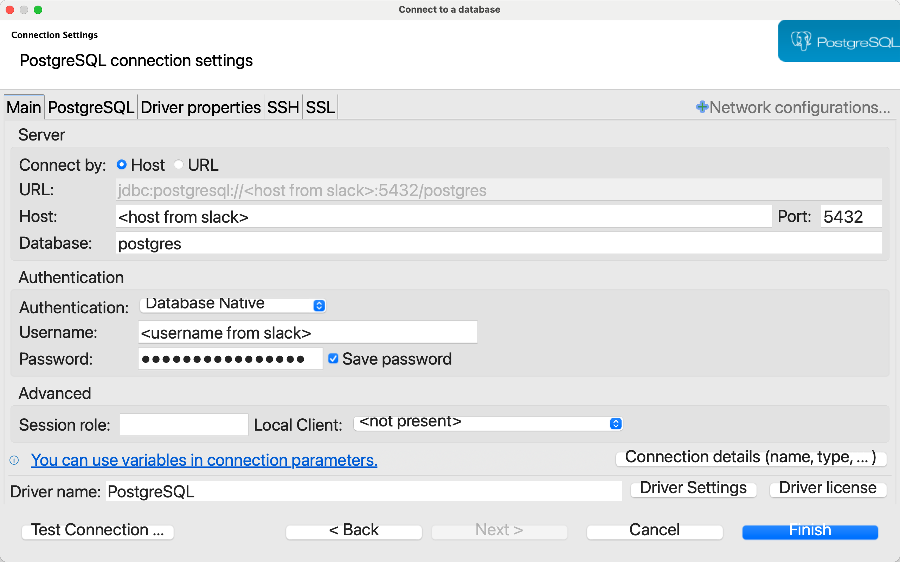

# Exercises 

## Access your database with DBeaver

You need to download [DBeaver](https://dbeaver.io). This is a free multi-platform database tool for developers, database administrators, analysts and all people who need to work with databases. 

- Open DBeaver and click on the little icon that looks like an electrical-plug with a plus (new connection).
- Select `PostgreSQL` as database.
- The required information to set up the connection (i.e. the credentials) will be shared through slack. Please update these connection Settings in DBeaver:
    - `Host`
    - `Database`
    - `User`
    - `Password`
    - `Port` (should be both times the same number already)
- click on `Test Connection ...`
    - if connection is not causing an error --> Finish
    - otherwise check all your copy/pasted information again (maybe you copied some spaces...)

Sometimes DBeaver will tell you that an additional driver is needed for the connection. In that case you can click on download / install and it should work afterwards.

The configuration should look something like this:


If the setup worked, on the left side of DBeaver you should see the newly created connection (if you didn't give a custom name it will be called postgres). If you click on it (i.e. the little arrow next to it) you can expand the path:"postgres" --> "databases" --> "postgres" -->"schemas" --> "introduction" --> "tables".


Now let's have a look at our data!

## SQL Queries

First, we need a file (SQL-Script) in which we write our queries. To create such a file, right click on the Schema you are interested in (for now, use 'introduction' please), select 'SQL-Editor' --> "new SQL script".

Into this script you can now write your Queries, and run them by clicking on the little yellow arrow (or using control + enter).

- **Schema**: 

    We are using one database with different schemas so first we have to choose the right one, (use quotes):
    ```SQL
    SET SCHEMA 'schema_name'; 
    ```

---
- **SELECT FROM**

    The basic command is:
    ```SQL
    SELECT the_data FROM table_name
    ```
   
    - select more than 1 columns with:
      ```SQL
      SELECT column_name_1, column_name_2 FROM table_name
      ```
   
    - select all columns
      ```SQL
      SELECT * FROM table_name
      ```
    - select unique values with:
      ```SQL
      SELECT DISTINCT column_name_1 FROM table_name
      ```

---
- **WHERE**
    Sometimes we want to retrieve only a subset of the data. In those cases, we use the WHERE keyword. 

    ```SQL
    SELECT column_name
    FROM table_name
    WHERE condition
    ```

    `Condition` represents how we want the data to be filtered.

    > **Exercise 1:** 
    > Explore all tables in the schema Introduction and use SQL to:
    > - get all cases for women
    > - get all cases for men between 20 and 50

----
- **JOINING TABLES**
    (inner join is default)

    ```SQL
    SELECT t1.name, t2.something FROM table1 t1
    INNER JOIN table2 t2 ON t1.key1 = t2.key2
    ```

    > **Exercise 2:** now with nice names (i.e. replace the id's with the respective values form the other tables)!
    > - get all cases for women
    > - get all cases for men between 20 and 50

---
- **ORDER BY**
    
    Sort by one or more columns

    ```SQL
    SELECT column_name
    FROM table_name
    WHERE condition
    ORDER BY column_name ASC
    ```
    
    The options are `ASC` and `DESC`.

    > **Exercise 3:** 
    > - get all cases for women, order them by age-groups ascending
    > - get all cases for men between 20 and 50, order them by record_date descending

---
- **MATHEMATICAL FUNCTIONS**

    eg. SUM ,AVG, COUNT, MAX, MIN

    > **Exercise 4:** 
    > - get average number of cases for women
    > - get maximum number of cases for men

---
- **GROUP BY**
    
    same as in Pandas

    ```SQL
    SELECT column_name_1, MAX(column_name_2) 
    FROM table
    GROUP BY column_name_1
    ```

    > **Exercise 5:** 
    > - get sum of cases per gender per age group

---
- **HAVING**
    
    The WHERE keyword is always used before GROUP BY. 

    HAVING is used to filter based on the result of a function.

    Eg. only include countries with more than 5 customers:

    ```SQL
    SELECT COUNT(column_name_2), column_name_1
    FROM table
    GROUP BY column_name_1
    HAVING COUNT(column_name_2) > 5; 
    ```

    > **Exercise 6:** 
    > - Get all the dates with more then 80,000 cases.
---

### General order of SQL Commands:
SQL - Queries need to stated in this specific order. You can not change the sequence.
1. SELECT 
1. FROM
1. WHERE
1. GROUP BY
1. HAVING
1. ORDER BY
1. LIMIT


---
## Resources:

https://en.wikipedia.org/wiki/Database

https://www.c-sharpcorner.com/UploadFile/65fc13/types-of-database-management-systems/

https://www.postgresqltutorial.com/postgresql-create-table/

https://theartofpostgresql.com/blog/2019-09-sql-joins/
